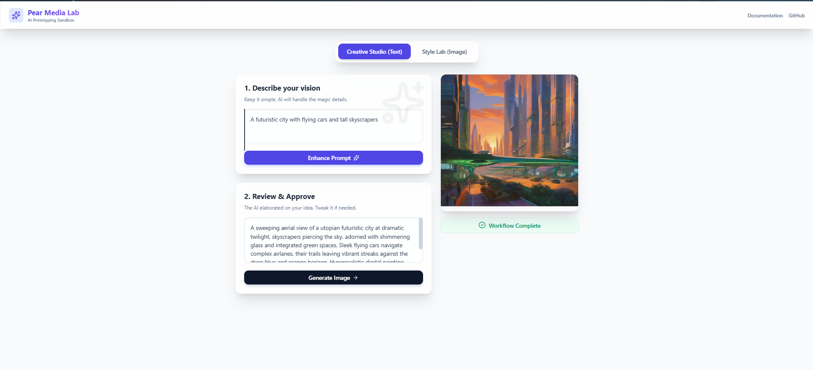
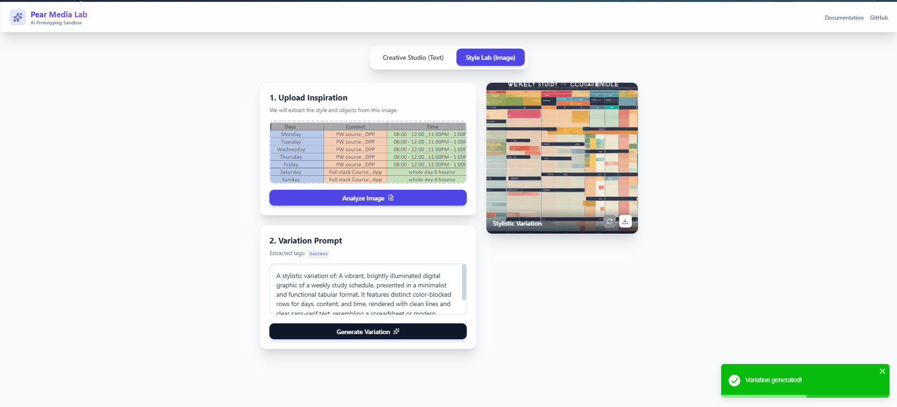

# Pear Media AI Lab 🍐

A responsive product prototype that integrates multiple AI APIs to perform text enhancement and image generation workflows.

## 📸 Screenshots


*Creative Studio - Enhancing text prompts with Gemini to generate images.*


*Style Lab - Reverse-engineering image styles to generate stylistic variations.*

---

## 🚀 Project Flow

The application provides two distinct workflows:

### 1. Creative Studio (Text Workflow)
- **Input:** Enter a simple spark of an idea.
- **Enhancement:** Powered by **Gemini 2.5 Flash**, the app magically enhances the simple thought into a comprehensive, professional visual prompt.
- **Generation:** Once approved, the enhanced prompt is sent to **Hugging Face Serverless Inference** to map to a high-quality visual generated by Stable Diffusion XL.

### 2. Style Lab (Image Workflow)
- **Input:** Upload any local image (enforced < 2MB limit).
- **Analysis:** Reverse-engineer the image's style, main subjects, and lighting properties using **Gemini 2.5 Flash Vision**.
- **Generation:** The app automatically constructs a new stylistic textual prompt to generate a fresh Image Variation based on the original's visual syntax.

---

## 🛠️ Installation & Setup

### Requirements
- Node.js environment (v18+)
- Active internet connection for API requests
- [Google AI Studio API Key](https://aistudio.google.com/)
- [Hugging Face API Key](https://huggingface.co/settings/tokens)

### Local Setup

1. **Clone the repository** (if you haven't already):
   ```bash
   git clone https://github.com/sumitshakya0987/PearMedia_Assignment
   cd pearmedia_assignment/pear-media-lab
   ```

2. **Install dependencies:**
   ```bash
   npm install
   ```

3. **Configure Environment Variables:**
   Create a `.env` file at the root of the project (alongside `package.json`) and populate it with your generated API keys:

   ```env
   VITE_GEMINI_KEY=your_gemini_api_key_here
   VITE_HF_KEY=your_huggingface_api_key_here
   ```

4. **Start the Development Server:**
   ```bash
   npm run dev
   ```

5. **Open in Browser:**
   Navigate to the Local URL provided in the terminal (usually `http://localhost:5173/`).

---

## 🧠 API Usage

The application leverages dual distinct backends via frontend fetching and Vite proxy networking:

- **Google Cloud (Gemini API):**
  - **`gemini-2.5-flash`:** Used for blazing-fast text intelligence to expand user shorthand into highly-detailed prompt strings.
  - **`gemini-2.5-flash` (Vision capabilities):** Used to ingest Base64 Data URIs of local image uploads and extract their core visual subjects and artistic formatting.
  - *Documentation:* [Google AI Studio docs](https://ai.google.dev/docs)

- **Hugging Face (Serverless Inference API):**
  - **`stabilityai/stable-diffusion-xl-base-1.0`:** A State-of-the-art latent text-to-image diffusion model used to render out the final prompts.
  - **Router Proxy:** All requests are safely routed through Vite's local dev server proxy configured for `https://router.huggingface.co/hf-inference` to prevent CORS issues without needing a full Node backend.
  - *Documentation:* [Hugging Face Inference docs](https://huggingface.co/docs/api-inference/)

---

## ☁️ Deployment (Vercel)

1. Push this project to your GitHub account.
2. Login to Vercel and select **Add New Project**.
3. Import the Github repository. 
4. In the setup phase, open the **Environment Variables** drop-down and add your keys exactly as they appear in your `.env`:
   - `VITE_GEMINI_KEY` -> `<your-key>`
   - `VITE_HF_KEY` -> `<your-key>`
5. Click **Deploy**. The application is configured to build perfectly with Vite's static adapter.
